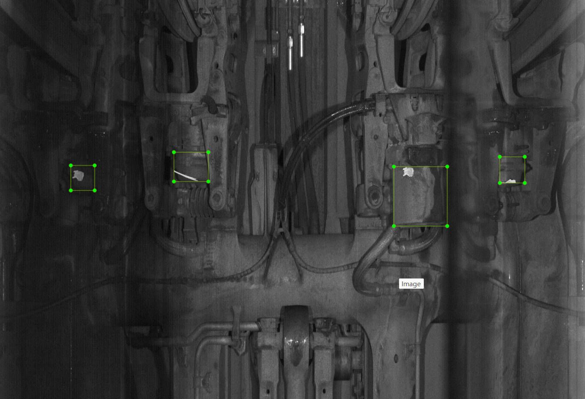

# 1 更新日期

2024-06-21

# 2 文件结构说明

| 文件名            | 说明         |
| ----------------- | ------------ |
| 01_Texture_pic.py | 执行的主文件 |
| cfg.py            | 配置文件     |

## 2.1 cfg.py参数说明

### 给随机数限制参数

```python3
# [配置参数]    前景权重值这只大点
#~ random params
## 贴图与原图贴图比重
gender_alpha_a:float = 0.5
gender_alpha_b:float = 0.8
## 旋转角度
gender_angle_a:int = -90
gender_angle_b:int =  90
## 中心位置偏移
gender_centerxy_a:float = 0.2 # 0.15
gender_centerxy_b:float = 0.3 # 0.35
## 贴图缩放尺寸
gender_resiz_a1:float = 1.
gender_resiz_b1:float = 1 # 2.0
gender_resiz_a2:float = 1# 0.8
gender_resiz_b2:float = 1# 1.2
gender_resiz_a3:float = 1# 0.5
gender_resiz_b3:float = 1# 1.0

```

### 限制输出框大小

```
## 最小框阈值
min_bbox:int = 8

```

### 其他设置

```
#~ other params
## 最大随机次数 控制生成样本个数
num:int = 1
## 线程池大小  控制生成速度
worker:int = 4
## 随机种子   控制随机数
random_seed = -1 
```

## 2.2 01_Texture_pic.py 需要修改部分

下面是贴胶泥。可以概括为在某个区域随机贴mask图。

```python3
def test_api(cfg):
    ## 在哪些标签内贴图
    relabels = dict(area='area_gai')
    # 语义分割类别值
    cfg.seg_label = 1
    #~ data src
    ## 原始图像和xml位置
    backgroud_dir = 'test_data_1/bg'  # 包含了img和xml
    backgroud_img_dir = backgroud_dir
    backgroud_xml_dir = backgroud_dir
    ## 贴图位置
    mask_dir = 'test_data_1/mask_fenbi'  
    ## 输出造的图像和xml的位置
    out_base = 'test_data_1'
  
    out_texture_dir = os.path.join(out_base,'out','bg_coped') 
    out_xml_dir =  os.path.join(out_base,'out','xml_coped')
    out_detxml_dir =  os.path.join(out_base,'out','mask_xml')
    out_seg_dir =  os.path.join(out_base,'out','seg_pic') 
    # cfg.IS_RELABEL = True
    cfg.gender_alpha_a = 0.4
    cfg.erode = 40
    func = Texture(backgroud_img_dir,backgroud_xml_dir ,mask_dir,out_texture_dir,out_xml_dir,out_detxml_dir,out_seg_dir ,relabels)
    func.loop()


```

下面是贴钉子。可以概括为有一定限制的贴某个mask，需要控制一定随机性。

```python3
def test_api2(cfg):
    ## 在哪些标签内贴图
    relabels = dict(ding_area='ding_area_gai')
    cfg.seg_label = 255
    #~ data src
    ## 原始图像和xml位置
    backgroud_dir = 'test_data_2/bg'  # 包含了img和xml
    backgroud_img_dir = backgroud_dir
    backgroud_xml_dir = backgroud_dir
    ## 贴图位置
    mask_dir = 'test_data_2/mask'        
    ## 输出造的图像和xml的位置
    out_base = 'test_data_2'
  
    out_texture_dir = os.path.join(out_base,'out','bg_coped') 
    out_xml_dir =  os.path.join(out_base,'out','xml_coped')
    out_detxml_dir =  os.path.join(out_base,'out','mask_xml')
    out_seg_dir =  os.path.join(out_base,'out','seg_pic') 
    # cfg.IS_RELABEL = True
    cfg.gender_alpha_a = 0.4
    cfg.erode = 40
    cfg.gender_angle_a:int = 0
    cfg.gender_angle_b:int =  0
    cfg.gender_centerxy_a:float = 0.1 # 0.15
    cfg.gender_centerxy_b:float = 0.0 # 0.35
    cfg.gender_alpha_a:float = 0.7
    func = Texture(backgroud_img_dir,backgroud_xml_dir ,mask_dir,out_texture_dir,out_xml_dir,out_detxml_dir,out_seg_dir ,relabels)
    func.loop()

```


# 3 生成结果说明

语义分割的mask图。0是背景，1，2，3...是类别。想要验证结果，可以把cfg.seg_label改成255。如图1。


检测的xml，包括两种：

- 框出贴图位置的xml，如图2，3；
- 框出贴图区域的xml，如图4，5；





# 4 贴钉子结果图示例


